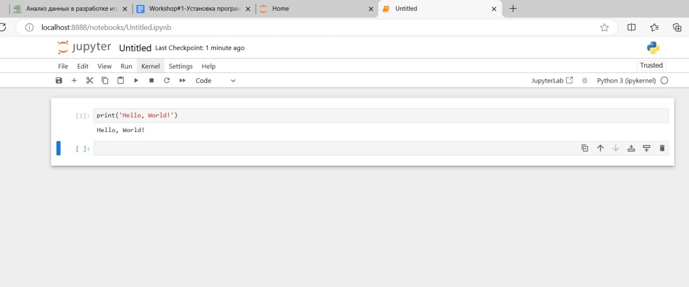
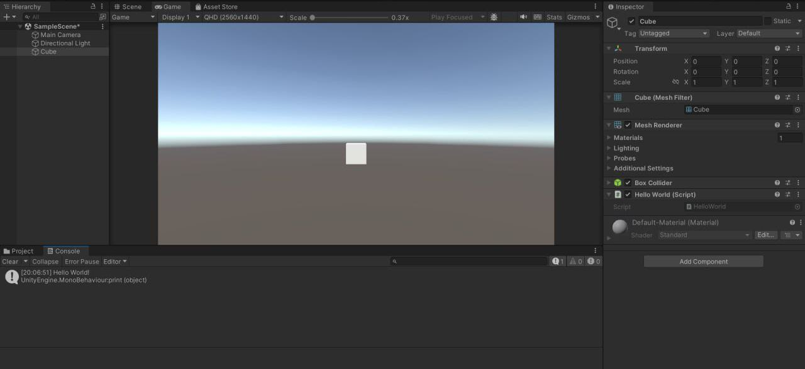

# АНАЛИЗ ДАННЫХ И ИСКУССТВЕННЫЙ ИНТЕЛЛЕКТ [in GameDev]
Отчет по лабораторной работе #1 выполнил(а):
- Абдуллина Алина Ильсеновна
- НМТ232918
Отметка о выполнении заданий (заполняется студентом):

| Задание | Выполнение | Баллы |
| ------ | ------ | ------ |
| Задание 1 | * | 60 |
| Задание 2 | * | 20 |
| Задание 3 | * | 20 |

знак "*" - задание выполнено; знак "#" - задание не выполнено;

Работу проверили:
- к.т.н., доцент Денисов Д.В.
- к.э.н., доцент Панов М.А.
- ст. преп., Фадеев В.О.

Структура отчета

- Данные о работе: название работы, фио, группа, выполненные задания.
- Цель работы.
- Задание 1.
- Код реализации выполнения задания. Визуализация результатов выполнения (если применимо).
- Задание 2.
- Код реализации выполнения задания. Визуализация результатов выполнения (если применимо).
- Задание 3.
- Код реализации выполнения задания. Визуализация результатов выполнения (если применимо).
- Выводы.
- ✨Magic ✨

## Цель работы
Установить необходимое программное обеспечение, которое пригодится для создания интеллектуальных моделей на Python. Рассмотреть процесс установки игрового движка Unity для разработки игр

## Задание 1
### Написать программу Hello World на Python с запуском в Jupiter Notebook.
Ход работы:
- Скачать и запустить Anacoda Navigator
- Скачать и запустить Jupyter Notebook
- Создать pythom-файл

## Задание 2
### Написать программу Hello World на C# с запуском на Unity.
Ход работы:
- Создайте новый 3D проект
- Подключить VisualStudio
- Написать программу Hello World на C#

## Задание 3
### Оформить отчет в виде документации на github (markdown-разметка).
Прямо перед вами

## Выводы

В ходе работы я смогла установить все необходимые для работы программы, научилась работать с Jupiter Notebook, создавать pythom-файл, а также создавать скрипты в Unity. Очень полезно и познавательно.

## Powered by

**Abdullina Alina**
