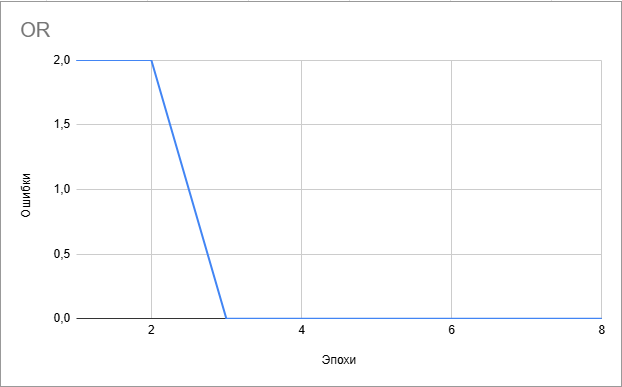

# АНАЛИЗ ДАННЫХ И ИСКУССТВЕННЫЙ ИНТЕЛЛЕКТ [in GameDev]
Отчет по лабораторной работе #1 выполнил(а):
- Абдуллина Алина Ильсеновна
- НМТ232918
Отметка о выполнении заданий (заполняется студентом):

| Задание | Выполнение | Баллы |
| ------ | ------ | ------ |
| Задание 1 | * | 60 |
| Задание 2 | * | 20 |
| Задание 3 | # | 20 |

знак "*" - задание выполнено; знак "#" - задание не выполнено;

Работу проверили:
- к.т.н., доцент Денисов Д.В.
- к.э.н., доцент Панов М.А.
- ст. преп., Фадеев В.О.

Структура отчета

- Данные о работе: название работы, фио, группа, выполненные задания.
- Цель работы.
- Задание 1.
- Код реализации выполнения задания. Визуализация результатов выполнения (если применимо).
- Задание 2.
- Код реализации выполнения задания. Визуализация результатов выполнения (если применимо).
- Задание 3.
- Код реализации выполнения задания. Визуализация результатов выполнения (если применимо).
- Выводы.
- ✨Magic ✨

## Цель работы
Ознакомиться с работой перцептрона

## Задание 1
### в проекте Unity реализовать перцептрон, который умеет производить вычисления:
OR | дать комментарии о корректности работы
AND | дать комментарии о корректности работы
NAND | дать комментарии о корректности работы
XOR | дать комментарии о корректности работы

Ход работы:
- Просмотреть лекцию и разобраться в работу перцептрона
- Скачать перцептрон и подключить его к пустому Game Object с именем Perceptron.
- Вводить данные логических оперций и проверять на корректность работы

OR| Работает корректно

AND| Работает корректно

NAND| Работает корректно

XOR| Работает неккоректно

## Задание 2
### Построить графики зависимости количества эпох от ошибки  обучения. Указать от чего зависит необходимое количество эпох обучения.

Ход работы:
- Поссмотреть как изменяются ошибки обучения в зависимости от эпох
- Ввести все необходимые данные
- Построить график зависимости

 

## Задание 3
### остроить визуальную модель работы перцептрона на сцене Unity.
Не получилось :(

## Выводы

В ходе работы я смогла изучить работы перцептрона и построить графики зависимости эпох от ошибок обучения

## Powered by

**Abdullina Alina**
