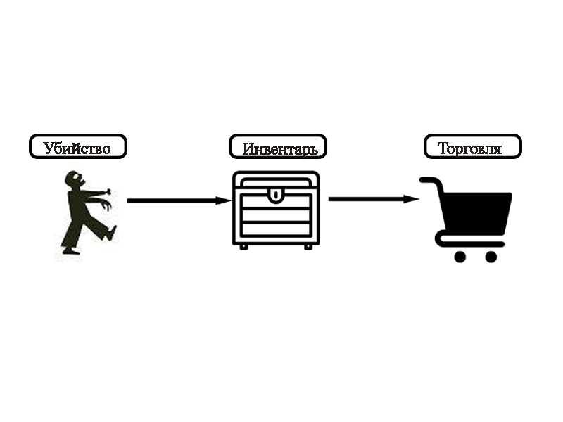

# АНАЛИЗ ДАННЫХ И ИСКУССТВЕННЫЙ ИНТЕЛЛЕКТ [in GameDev]
Отчет по лабораторной работе #1 выполнил(а):
- Абдуллина Алина Ильсеновна
- НМТ232918
Отметка о выполнении заданий (заполняется студентом):

| Задание | Выполнение | Баллы |
| ------ | ------ | ------ |
| Задание 1 | * | 60 |
| Задание 2 | * | 20 |
| Задание 3 | * | 20 |

знак "*" - задание выполнено; знак "#" - задание не выполнено;

Работу проверили:
- к.т.н., доцент Денисов Д.В.
- к.э.н., доцент Панов М.А.
- ст. преп., Фадеев В.О.

Структура отчета

- Данные о работе: название работы, фио, группа, выполненные задания.
- Цель работы.
- Задание 1.
- Код реализации выполнения задания. Визуализация результатов выполнения (если применимо).
- Задание 2.
- Код реализации выполнения задания. Визуализация результатов выполнения (если применимо).
- Задание 3.
- Код реализации выполнения задания. Визуализация результатов выполнения (если применимо).
- Выводы.
- ✨Magic ✨

## Цель работы
Научиться передавать в Unity данные из Google Sheets с помощью Python.

## Задание 1
### Выберите одну из игровых переменных в игре СПАСТИ РТФ: Выживание (HP, SP, игровая валюта, здоровье и т.д.), опишите её роль в игре, условия изменения / появления и диапазон допустимых значений. Постройте схему экономической модели в игре и укажите место выбранного ресурса в ней.

Ход работы:
- Изучить игру и выбрать одну из игровых переменных (в моем случае - игровая валюта)
- Описать роль игровой валюты в игре
- Построить схему экономической модели и указать место игровой валюты в ней

Игровая валюта (РТФ coin) – игровая переменная, служащая наградой за успешное выполнение задания (убийства зомби), которую можно обменять в магазине на новое оружие, патроны или увеличение количества HP. РТФ монеты выпадают с убитых зомби и чем больше мы убиваем – тем больше монет. С помощью дополнительных очков можно купить бафф, увеличивающий количество выпадающих монет и бафф, увеличивающий скорость собирания выпавших монет. Максимальное количество собранных момент больше 5000.

## Задание 2
###  С помощью скрипта на языке Python заполните google-таблицу данными, описывающими выбранную игровую переменную в игре “СПАСТИ РТФ:Выживание”. Средствами google-sheets визуализируйте данные в google-таблице (постройте график / диаграмму и пр.) для наглядного представления выбранной игровой величины. Опишите характер изменения этой величины, опишите недостатки в реализации этой величины (например, в игре может произойти условие наступления эксплойта) и предложите до 3-х вариантов модификации условий работы с переменной, чтобы сделать игровой опыт лучше.

Ход работы:
- Настроить доступ к google-таблице по api
- Генерация данных с помощью Python и их передача в google таблицу
- Запускаем .ipynb-файл, строим диаграмму на основании полученных значений.

Характер изменения игрвой валюты
Чем больше монстров мы убиваем, тем больше получаем монет, с боссов падает больше монет, чем с обычных мобов. По мере роста уровня количество выпадаемых монет также увеличивается и добавляются дополнительные монеты. Также с помощью баффов модно увелечить количество выпадаемых монет и скорость собирания монет.

Недостатки
В игре много способ увеличить количество собираемых монет и ускорить сам процесс собирания: с помощью баффов, прокачки оружи и т.п. Также можно получитть дополнительные монеты за просмотр рекламы неограниченное количество раз. К тому же после смерти собранные монеты не пропадают. Все это приводит к тому что уже ближе к 3 уровню пропадает необходимость собирать монеты, а так как монеты являются единственной наградой за убийство мобов, то пропадает желание активно уничтожать зомби и спасать РТФ. 

Вариант модификаций
Ввести какие либо санкции, забирающие деньги у игроков: за нахождение на запрещенной территории, за смерть или сильные раны (например нужно постоянно закупаться аптечкой или лекарствами от заражения), сделать оружие непрочным, чтобы была необходимоть не только постоянно покупать патроны, но и обновлять оружие; ввести дебаффы на здоровье или количество выпадения монет с зомби.

## Задание 3
###  Настройте на сцене Unity воспроизведение звуковых файлов, описывающих динамику изменения выбранной переменной. Например, если выбрано здоровье главного персонажа вы можете выводить сообщения, связанные с его состоянием.

- Создать на сцене Unity пустой GameObject и подключить к нему .cs скрипт, в котором описывается подключение к google-таблице по API и воспроизведение звуков в игре в соответствии со считываемыми значениями
- Настроить инспектор свойств объекта GameObject
- Запустить сцену

  
## Выводы
В ходе работы я научилась передевать в Unity данные из Google Sheets с помощью Python, анализировать игровые переменные, их изменения, а также визуализировать полученные данные в таблице и диаграмме. Настраивать совместную работу Google sheets и Unity.

## Powered by

**Abdullina Alina**
